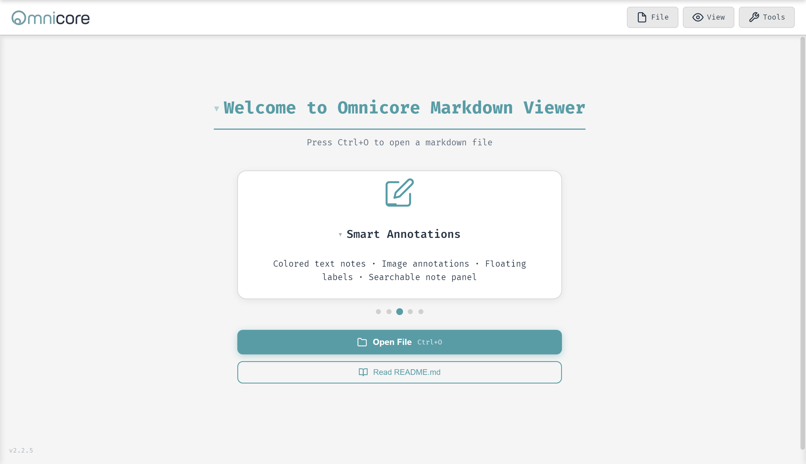
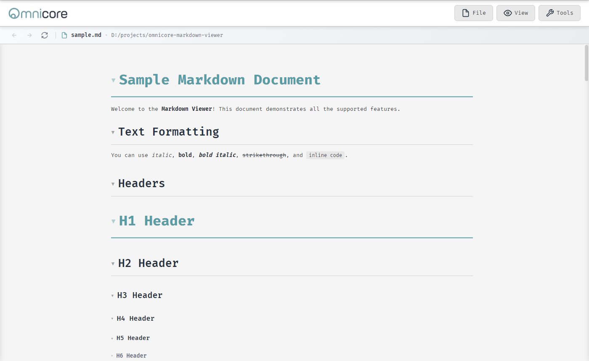
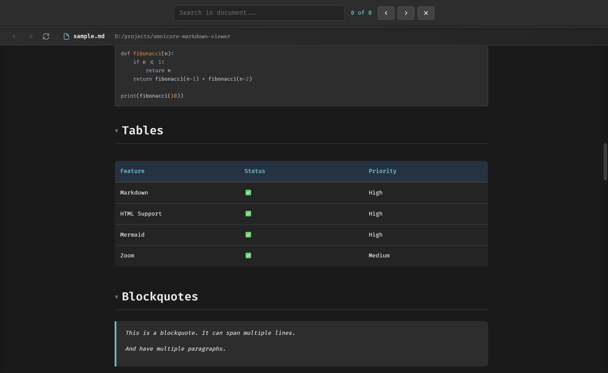
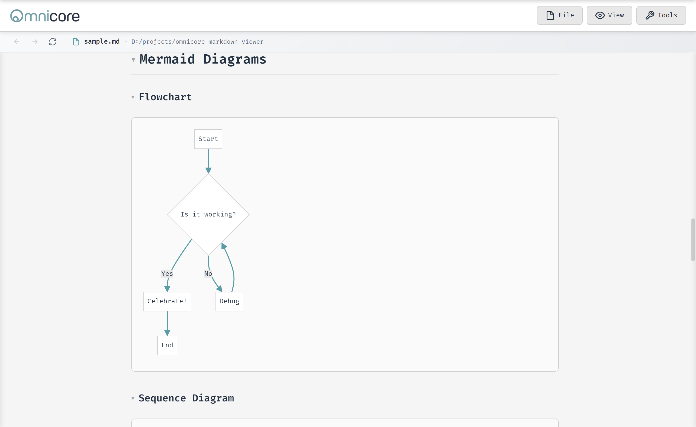
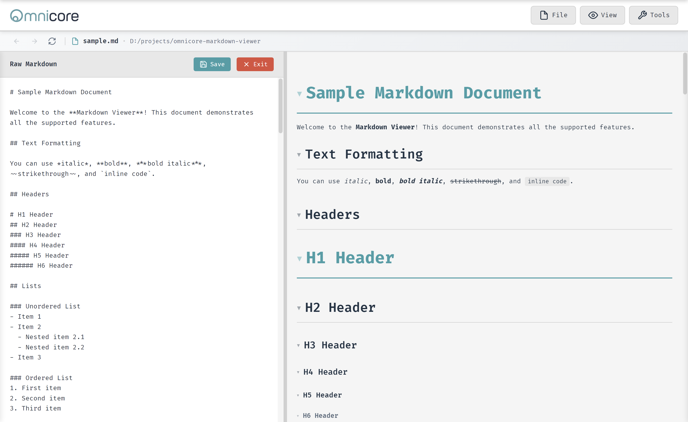
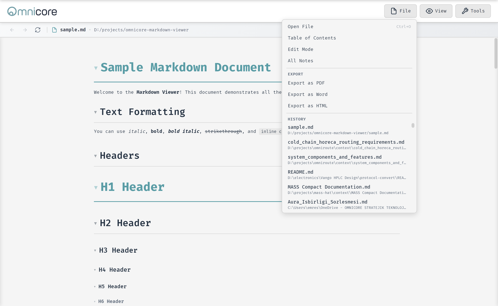
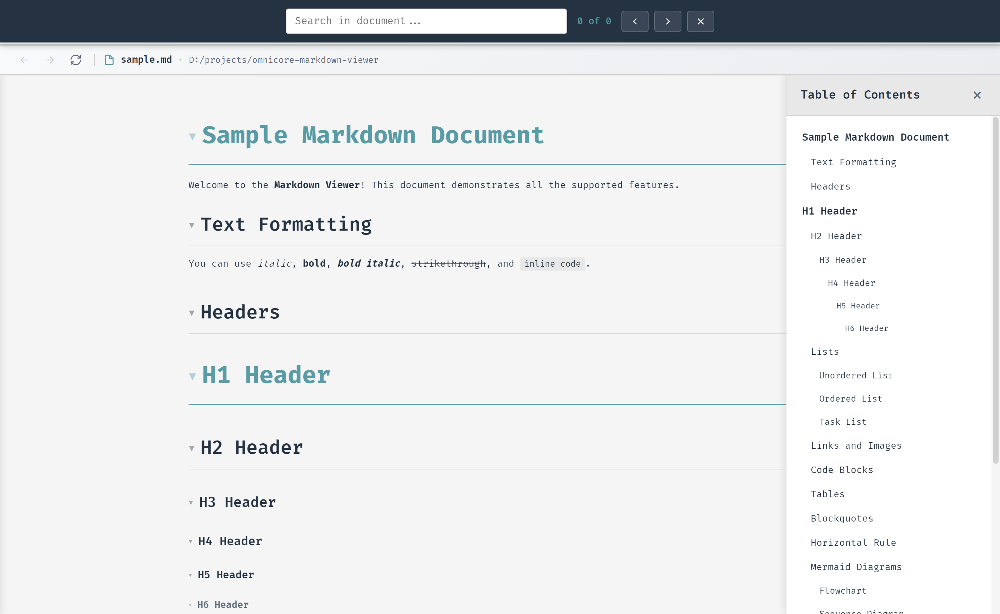
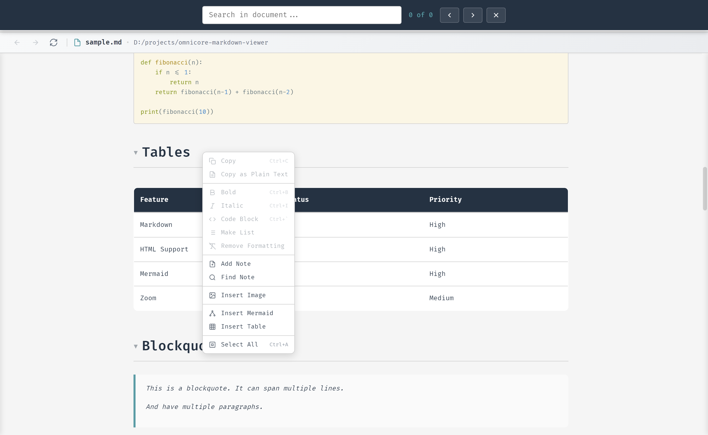
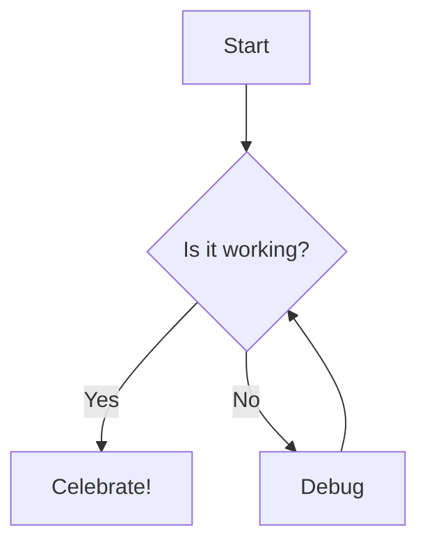

# Omnicore Markdown Viewer

<div align="center">
  
  <p><strong>A sleek, cross-platform desktop markdown viewer with full HTML support, diagram rendering, live editing, and smart annotations.</strong></p>
</div>


---

<div align="center">
  
</div>

## Features

### Core Rendering
- **Full HTML Support** — Render HTML tags inside markdown with DOMPurify sanitization
- **Mermaid Diagrams** — All diagram types (flowchart, sequence, class, ER, Gantt, pie, git, mindmap, timeline, …) with popup pan/zoom viewer and SVG cache for instant dark-mode switching
- **D2 Diagrams** — Architecture and system diagrams via Terrastruct D2 (WASM, dagre layout) with pan/zoom popup
- **OmniWare Wireframes** — Built-in wireframe DSL rendered as interactive mockups, with maximize popup and PDF export
- **tscircuit Schematics** — Render `.circuit.tsx` files and fenced `tscircuit` blocks as electronic schematics with pan/zoom popup
- **PrismJS Syntax Highlighting** — Code blocks with Solarized Light theme (11+ languages, fully offline)
- **Interactive Tables** — Tabulator.js popup on hover with column sorting, per-column filters, pagination, and CSV/JSON export

### Editing & Export
- **Live Markdown Editor** — Split-view editing with 400ms debounced preview and Fira Code font
- **Inline Text Editing** — Right-click any selected text to edit it in place without a full page re-render
- **Undo / Redo** — Ctrl+Z / Ctrl+Y undo/redo stack covering all view-mode edits
- **PDF Export** — One-click export with full styling, diagrams, and syntax highlighting
- **Word Export** — Export documents as Microsoft Word (.docx) files
- **HTML Export** — Export as a standalone HTML file (fully offline, no CDN dependencies)
- **Drag-and-Drop** — Drag any `.md` file onto the app window to open it instantly

### Diagram Dialogs
Right-click anywhere in the document to insert or edit diagrams and tables without writing code manually.

- **Insert Mermaid** — Choose from 12 diagram templates with a live preview panel
- **Edit Mermaid** — Right-click any diagram to open the editor pre-filled with its source
- **Delete Mermaid** — Remove diagrams via right-click; source is patched without re-render
- **Insert Table** — Configure rows, columns, and header row with a live table preview
- **Edit / Delete Table** — Full table management via right-click

### Note System
Select any text and annotate it with a colored note. Notes appear as highlighted, underlined text with a tooltip on hover.

- **Text & Image Notes** — Annotate text selections or images
- **Note Labels** — Floating label badges placed anywhere in the document
- **All Notes Panel** — Side panel listing all notes sorted by ID with search
- **6 Colors** — Orange, red, green, blue, purple, yellow
- **Show/Hide Notes** — Toggle visibility; when hidden, notes are completely invisible

### Right-Click Context Menu
A comprehensive context menu is available anywhere with a right-click.

- Copy / Copy as Plain Text
- Edit Text, Bold, Italic, Code Block, Make List, Remove Formatting
- Add / Edit / Delete / Find Note
- Insert / Edit / Delete Mermaid
- Insert / Edit / Delete Table
- Insert / Delete Image
- Copy Code, Copy Image Source, Select All

### Navigation & UI
- **Dropdown Menus** — Organized **File**, **View**, and **Tools** menus
  - **File** — Open, Table of Contents, Edit Mode, All Notes, Export (PDF / Word / HTML), Recent Files (last 100)
  - **View** — Zoom, Dark Mode, Fullscreen
  - **Tools** — Document translation and interface language settings
- **Table of Contents** — Auto-generated hierarchical TOC (H1–H6) with one-click navigation and active-section highlighting
- **Real-Time Search** — Match counter, navigation arrows, and keyboard nav (Ctrl+F)
- **File Path Display** — Current file path with copy-to-clipboard
- **Resizable Dialogs** — Mermaid, table, and other dialogs are drag-resizable

### Theme & View
- **Dark Mode** — Instant toggle (Ctrl+D); Mermaid / D2 SVGs redraw in-place, all other styling is CSS-driven — no full re-render
- **Zoom** — 50%–200% via keyboard shortcuts or Ctrl+Mouse Wheel
- **Fullscreen** — Distraction-free viewing (F11)

### File Watching & Performance
- **File Change Detection** — Non-intrusive toast appears when the file is modified externally, with Reload / Dismiss buttons
- **Smart Pause/Resume** — File watching automatically pauses while you have unsaved changes and resumes on save
- **Emoji Shortcodes** — 900+ GitHub-style shortcodes (`:star:` → ⭐) converted before parsing
- **Mermaid SVG Cache** — Unchanged diagrams are restored from cache without re-running Mermaid
- **Partial DOM Rendering** — Formatting changes (bold, italic, code) patch only the affected node — no page refresh

### Translation & Localization
- **Document Translation** — Translate documents to English or Turkish via Google Translate (runs in background, non-blocking)
- **Interface Language** — Switch UI language between English and Turkish
- **Dual-Source Editing** — Edit while viewing translations without switching back

---

## Screenshots

### Light Mode

<div align="center">
  
  <p><em>Light mode — markdown rendered with full typography, headers, and navigation bar</em></p>
</div>

### Dark Mode

<div align="center">
  
  <p><em>Dark mode — syntax-highlighted code blocks, interactive table, and blockquote</em></p>
</div>

### Mermaid Diagrams

<div align="center">
  
  <p><em>Mermaid diagram — all diagram types render with auto-theming and a pop-out zoom viewer</em></p>
</div>

### Live Editor

<div align="center">
  
  <p><em>Split-view editor — raw markdown on the left, live preview on the right</em></p>
</div>

### File Menu & Exports

<div align="center">
  
  <p><em>File menu — open, TOC, edit mode, notes, and export to PDF / Word / HTML</em></p>
</div>

### Table of Contents

<div align="center">
  
  <p><em>Auto-generated hierarchical TOC sidebar with one-click section navigation</em></p>
</div>

### Context Menu

<div align="center">
  
  <p><em>Right-click context menu — formatting, notes, diagram and table management</em></p>
</div>

---

## Installation

### Download Pre-built Releases

Download the latest release from the [Releases page](https://github.com/OmniCoreST/omnicore-markdown-viewer/releases):

| Platform | File | Description |
|----------|------|-------------|
| Windows | `Omnicore-Markdown-Viewer-Setup-X.X.X.exe` | Windows installer |
| Linux | `Omnicore.Markdown.Viewer-X.X.X.AppImage` | Portable AppImage |
| Linux | `omnicore-markdown-viewer_X.X.X_amd64.deb` | Debian/Ubuntu package |

### Windows Installation Note

> **"Windows protected your PC" Warning**
>
> On first run, Windows SmartScreen may show a warning because the app is not code-signed.
>
> **To proceed:**
> 1. Click **"More info"**
> 2. Click **"Run anyway"**
>
> This is safe — you can verify the source code in this repository.

### Build from Source

```bash
npm install
npm start          # run in development mode
```

---

## Building for Production

```bash
npm run build            # portable .exe (Windows, no installation)
npm run build-installer  # Windows installer (NSIS)
npm run build-all        # both portable exe and installer
```

Output is placed in the `dist/` folder.

---

## Keyboard Shortcuts

| Shortcut | Action |
|----------|--------|
| `Ctrl+O` | Open markdown file |
| `Ctrl+S` | Save file (edit mode) |
| `Ctrl+Z` / `Ctrl+Y` | Undo / Redo view-mode edits |
| `Ctrl+F` | Open search panel |
| `Ctrl+B` | Bold selected text |
| `Ctrl+I` | Italic selected text |
| `Ctrl+`` ` `` | Code block |
| `Ctrl+D` | Toggle dark mode |
| `Ctrl++` / `Ctrl+-` | Zoom in / out |
| `Ctrl+0` | Reset zoom to 100% |
| `Ctrl+Enter` | Confirm in dialogs |
| `Enter` / `Shift+Enter` | Next / previous search match |
| `Escape` | Close panel or dialog |
| `F11` | Toggle fullscreen |
| `Tab` (editor) | Insert 2 spaces |

**Mouse:** `Ctrl+Mouse Wheel` to zoom. Right-click anywhere for the context menu.

---

## Opening Files

| Method | How |
|--------|-----|
| Within the app | `Ctrl+O` or **File → Open File** |
| Drag and drop | Drag any `.md` file onto the app window |
| Windows "Open With" | Right-click `.md` file → Open with → Omnicore Markdown Viewer |
| Default program | Set via the NSIS installer; double-click any `.md` file |

---

## Supported File Types

| Extension | Type |
|-----------|------|
| `.md`, `.markdown`, `.mdown`, `.mkd`, `.mkdn` | Markdown |
| `.mermaid` | Mermaid diagram (auto-wrapped in a code fence) |
| `.circuit.tsx` | tscircuit schematic (auto-wrapped in a code fence) |
| `.ow` | OmniWare wireframe (auto-wrapped in a code fence) |

---

## Diagram Support

### Mermaid

All Mermaid diagram types are supported. Use fenced code blocks or right-click to insert:

````markdown

````

Right-click anywhere and choose **Insert Mermaid** to pick from 12 built-in templates with a live preview.

### D2

Architecture and system diagrams with nested containers:

````markdown
```d2
api: API Gateway
db: {shape: cylinder; label: Postgres}
api -> db: query
```
````

### OmniWare Wireframes

UI mockups and screen layouts:

````markdown
```omniware
@page title="Dashboard"
@nav brand="MyApp" items=["Home","Reports","Settings"]
@section title="Overview"
@metric label="Users" value="1,234" trend="up"
```
````

### tscircuit Schematics

Electronic circuit schematics using TSX:

````markdown
```tscircuit
import { useRedLed, useResistor } from "@tsci/seveibar.red-led"
export default () => (
  <board width="10mm" height="10mm">
    <led name="LED1" footprint="0402" />
    <resistor name="R1" resistance="1k" footprint="0402" />
  </board>
)
```
````

---

## Technology Stack

| Library | Version | Purpose |
|---------|---------|---------|
| [Electron](https://www.electronjs.org/) | 27 | Cross-platform desktop framework |
| [Marked](https://marked.js.org/) | latest | Fast GFM markdown parser |
| [Mermaid](https://mermaid.js.org/) | latest | Diagram rendering engine |
| [D2](https://d2lang.com/) | WASM | Architecture diagram language |
| [Tabulator.js](https://tabulator.info/) | 6.2.5 | Interactive table library |
| [PrismJS](https://prismjs.com/) | latest | Syntax highlighting |
| [DOMPurify](https://github.com/cure53/DOMPurify) | latest | HTML sanitization |
| OmniWare | built-in | Wireframe DSL renderer |
| [@tscircuit/eval](https://github.com/tscircuit/tscircuit) | bundled | Circuit schematic renderer |

All libraries are bundled for **fully offline operation** — no internet connection required (except for the translation feature).

---

## Contributing

Contributions are welcome! Please feel free to submit a Pull Request.

1. Fork the repository
2. Create your feature branch (`git checkout -b feature/AmazingFeature`)
3. Commit your changes (`git commit -m 'Add some AmazingFeature'`)
4. Push to the branch (`git push origin feature/AmazingFeature`)
5. Open a Pull Request

---

## License

MIT License — see the [LICENSE](LICENSE) file for details.

---

<div align="center">
  Developed by <a href="https://www.omnicore.com.tr">Omnicore</a>
</div>