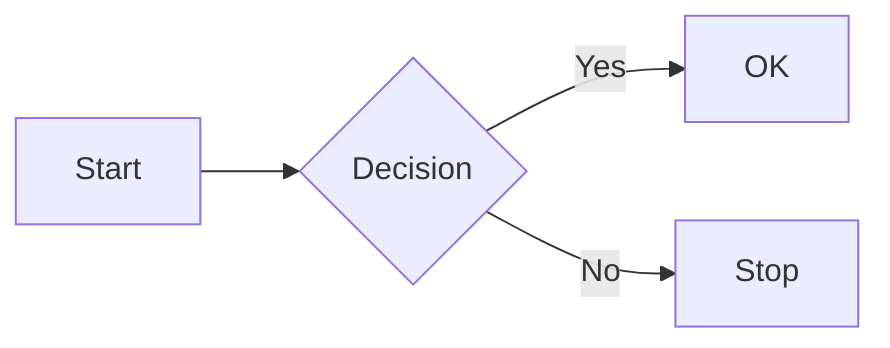

# D2 Diagram Test

## Simple flow

```d2
users -> api -> database
api -> cache
```

## Shapes & styles

```d2
server: {
  shape: rectangle
  style.fill: "#279EA7"
  style.stroke: "#1F3244"
}

db: Database {
  shape: cylinder
}

server -> db: queries
```

## Mermaid still works alongside D2



## Class diagram in D2

```d2
MyClass: {
  shape: class

  +field: string
  -privateField: int

  +method(): void
  +greet(name: string): string
}
```

## SQL table

```d2
users: {
  shape: sql_table
  id: int {constraint: primary_key}
  name: string
  email: string
}

orders: {
  shape: sql_table
  id: int {constraint: primary_key}
  user_id: int {constraint: foreign_key}
  total: decimal
}

orders.user_id -> users.id
```
