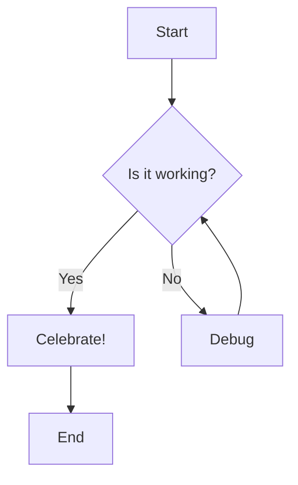
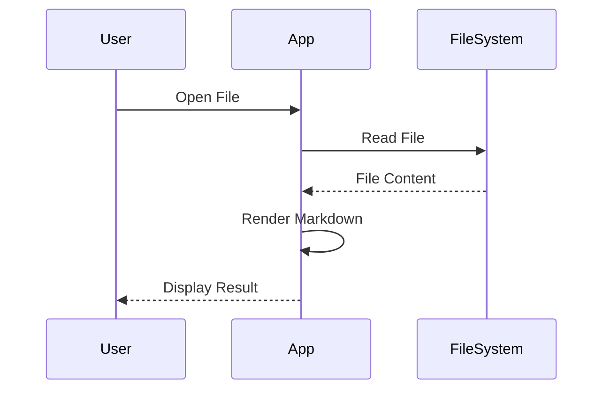
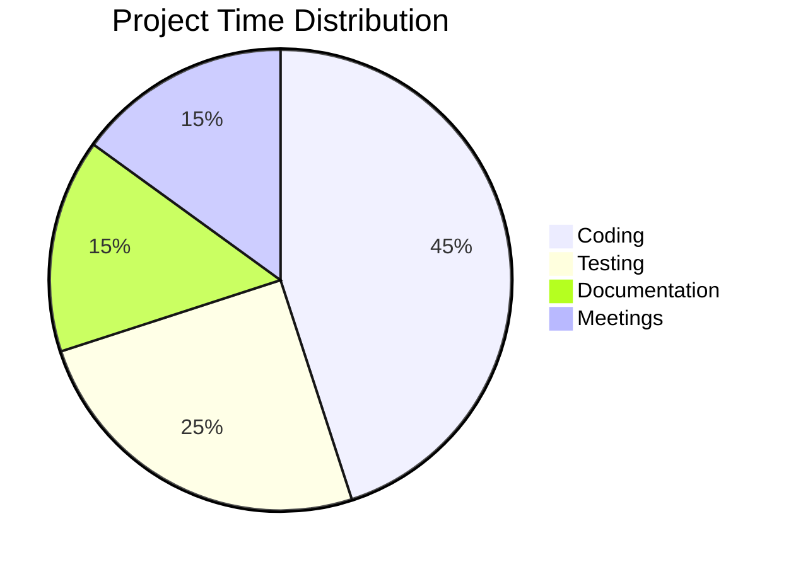
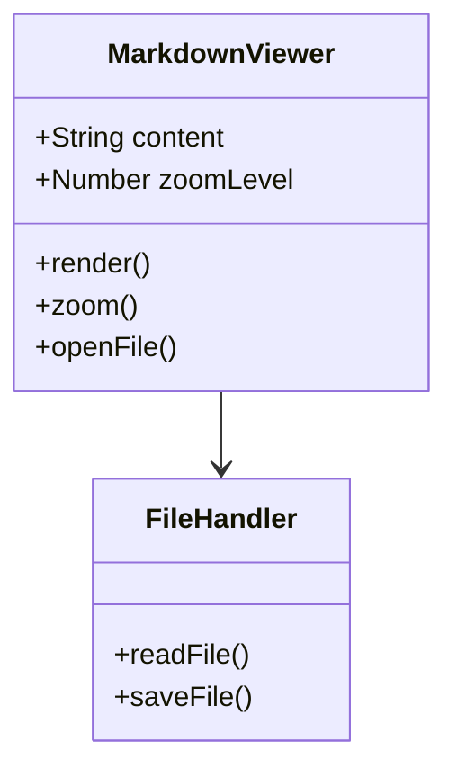

# Sample Markdown Document

Welcome to the **Markdown Viewer**! This document demonstrates all the supported features.

## Text Formatting

You can use *italic*, **bold**, ***bold italic***, ~~strikethrough~~, and `inline code`.

## Headers

# H1 Header
## H2 Header
### H3 Header
#### H4 Header
##### H5 Header
###### H6 Header

## Lists

### Unordered List
- Item 1
- Item 2
  - Nested item 2.1
  - Nested item 2.2
- Item 3

### Ordered List
1. First item
2. Second item
3. Third item

### Task List
- [x] Completed task
- [ ] Incomplete task
- [ ] Another task

## Links and Images

Check out [Anthropic](https://www.anthropic.com) for more information.

## Code Blocks

Here's a JavaScript code block:

```javascript
function greet(name) {
  console.log(`Hello, ${name}!`);
  return `Welcome to Markdown Viewer`;
}

greet('World');
```

Python example:

```python
def fibonacci(n):
    if n <= 1:
        return n
    return fibonacci(n-1) + fibonacci(n-2)

print(fibonacci(10))
```

## Tables

| Feature | Status | Priority |
|---------|--------|----------|
| Markdown | ✅ | High |
| HTML Support | ✅ | High |
| Mermaid | ✅ | High |
| Zoom | ✅ | Medium |

## Blockquotes

> This is a blockquote.
> It can span multiple lines.
>
> And have multiple paragraphs.

## Horizontal Rule

---

## Mermaid Diagrams

### Flowchart



### Sequence Diagram



### Pie Chart



### Class Diagram



## HTML Support

You can use HTML tags in markdown:

<div style="background: linear-gradient(135deg, #667eea 0%, #764ba2 100%); padding: 20px; border-radius: 10px; color: white;">
  <h3>This is HTML!</h3>
  <p>The viewer supports HTML tags within markdown for rich content.</p>
</div>

<details>
<summary>Click to expand</summary>

This is hidden content that can be revealed!

```javascript
console.log('Hidden code block');
```

</details>

## Math-like notation

You can use subscript and superscript:

- H<sub>2</sub>O
- E = mc<sup>2</sup>

## Keyboard Shortcuts

Press <kbd>Ctrl</kbd> + <kbd>O</kbd> to open a file.

Use <kbd>Ctrl</kbd> + <kbd>+</kbd> to zoom in and <kbd>Ctrl</kbd> + <kbd>-</kbd> to zoom out.

## Emoji Support

If your system supports emoji, they should render: 🎉 🚀 ✨ 💡 📝

---

## Conclusion

This viewer provides a clean, colorful interface for viewing markdown documents with support for:

- Full markdown syntax
- HTML tags
- Mermaid diagrams
- Code highlighting with Fira Code font
- Zoom controls
- Fullscreen mode

Enjoy your markdown viewing experience! 🎨
