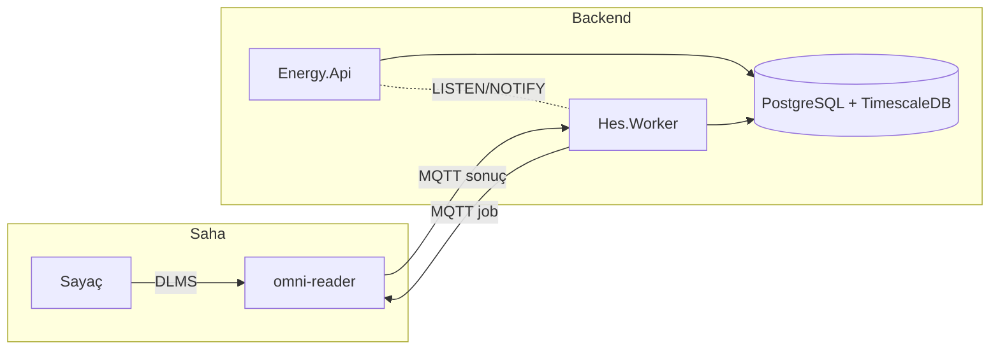
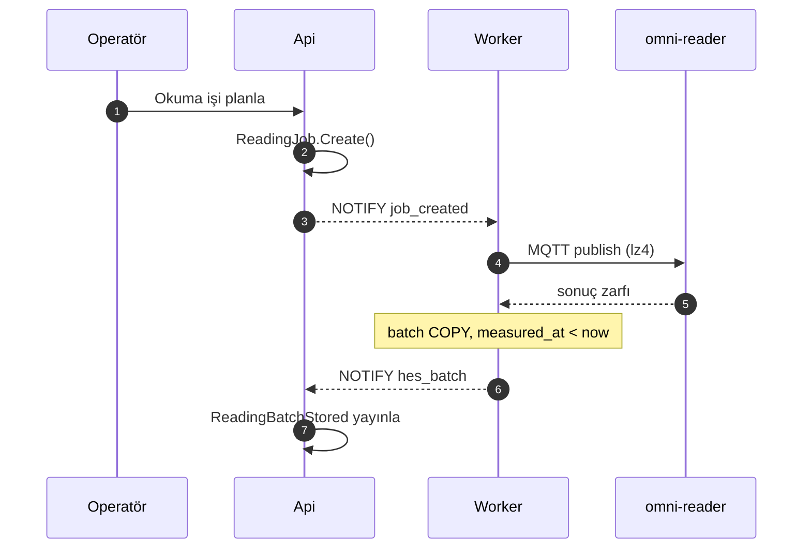
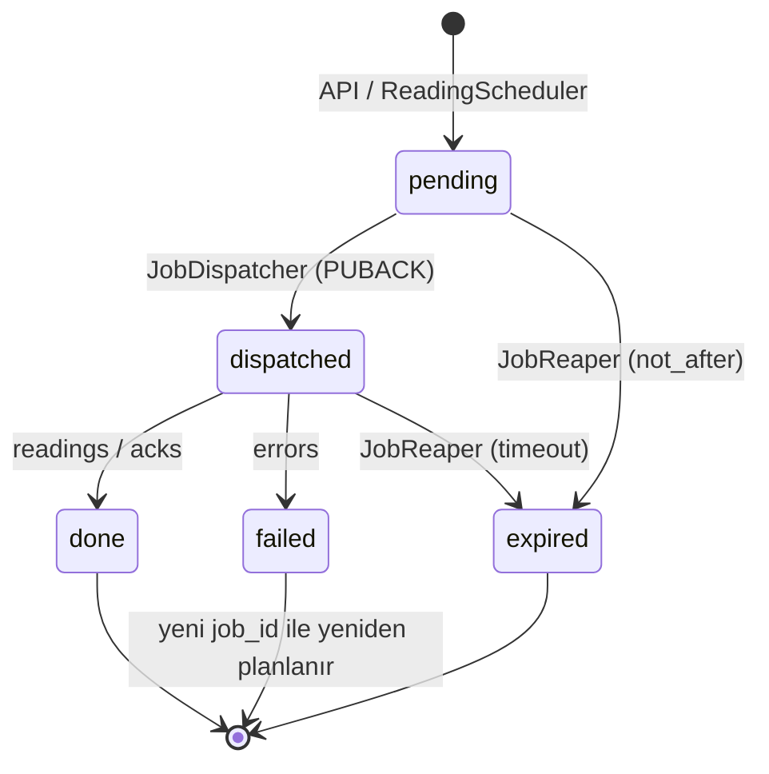
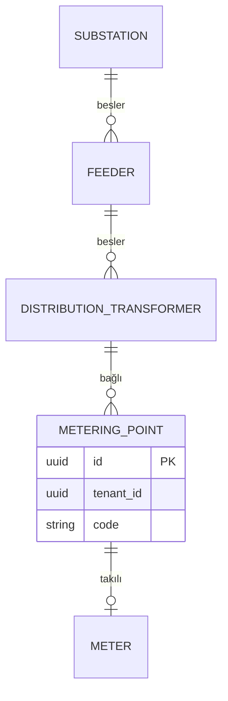
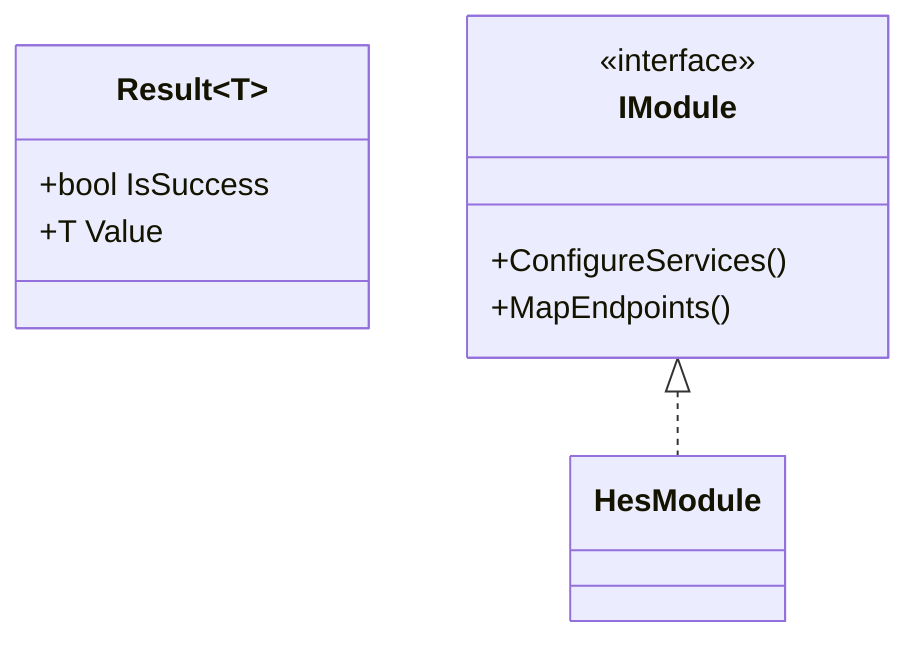
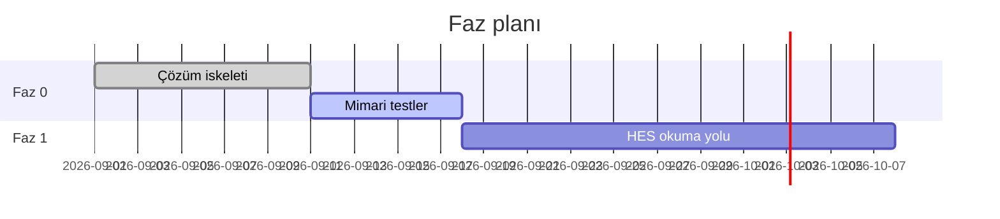
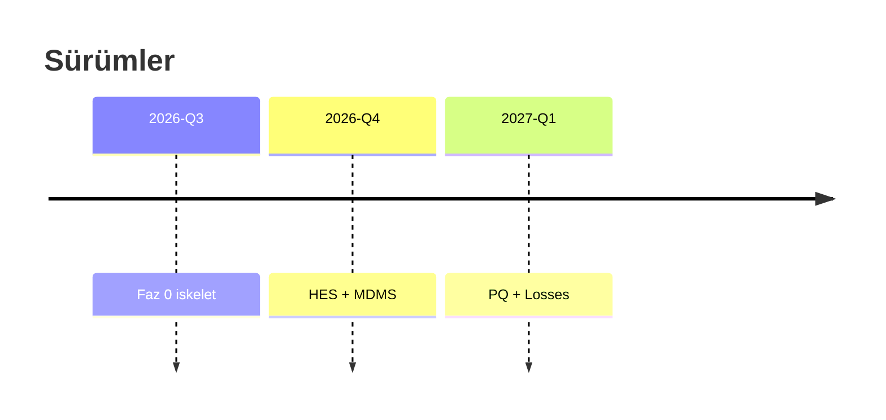
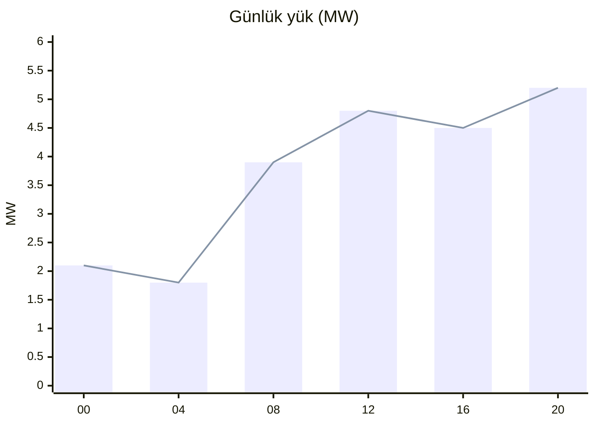

# Mermaid in the Omnicore viewer

Both viewers bundle **Mermaid 10.9.5**; `package.json` says 10.6.1, which is out of date. They initialise it like this:

- `startOnLoad:false`;
- theme `default`, or `dark` when VS Code or the app is dark;
- teal/navy `themeVariables`, font Fira Code 13px;
- no `securityLevel`, so the default `strict` applies.

Every example on this page was rendered with the real bundle (`check_md.py --render`).

## Contents
1. Fence rules
2. Diagram types
3. Label rules
4. Directives, theme, errors
5. Verified examples

## 1. Fence rules

- Any fenced code block whose info string starts with `mermaid` becomes a diagram: ```` ``` ```` or `~~~`, any case, extra words allowed. A Mermaid example inside another code block stays code.
- `.mmd` / `.mermaid` files are wrapped in a mermaid fence automatically. Write the raw diagram without a fence.
- These behaviours need extension ≥ 1.2.0 / desktop ≥ 2.3.0. Older viewers matched the raw text and broke on `$$` and `<`.

## 2. Diagram types

| Works in 10.9.5 | First line |
|---|---|
| Flowchart | `flowchart LR` / `flowchart TD` (`graph` also works) |
| Sequence | `sequenceDiagram` |
| Class | `classDiagram` |
| State | `stateDiagram-v2` |
| Entity-relationship | `erDiagram` |
| Gantt | `gantt` |
| Pie | `pie title …` |
| User journey | `journey` |
| Git graph | `gitGraph` |
| Mind map | `mindmap` |
| Timeline | `timeline` |
| Quadrant | `quadrantChart` |
| Sankey | `sankey-beta` |
| XY chart (bar/line) | `xychart-beta` |
| Block | `block-beta` |
| Requirement | `requirementDiagram` |
| C4 | `C4Context`, `C4Container`, `C4Component`, `C4Dynamic`, `C4Deployment` |

**Not in 10.9.5** (they render the "Syntax error in text" bomb): `architecture-beta`, `kanban`, `packet-beta`, `radar-beta`, `treemap`, `zenuml`. Use `flowchart` + `subgraph` for architecture and a table for kanban. Avoid `flowchart-elk`; it is present in the bundle but untested.

## 3. Label rules

The source is passed to Mermaid as text, and Mermaid's `strict` security level sanitizes labels. This is the same as on GitHub.

| Source | Result |
|---|---|
| `A["Vin<Vmax"]`, `B[List<T>]` | renders, but the label is cut at `<`: "Vin", "List" |
| `A["Vin #lt; Vmax"]`, `#gt;`, `#quot;` (Mermaid entities) | OK, shows `<`, `>`, `"` |
| `A["Vin < Vmax"]` (spaces around `<`) | OK |
| `class Repo~T~` (Mermaid generics) | OK, shows `Repo<T>` |
| `<<interface>>` in a class diagram | OK |
| `A[Satır 1<br>Satır 2]` | OK, line break |
| sequence text `x < y && y > z`, `$`, `$$` | OK |

Other label notes:
- `&` and Turkish characters are fine.
- Quote labels that contain `(`, `)`, `[`, `]`, `:` or `|`: `A["Ölçüm (15 dk)"]`.
- Markdown strings work: `` A["`**kalın** metin`"] ``.
- `click X href "…"` / `click X call …` do nothing, because strict mode disables them. Don't use `click`.

## 4. Directives, theme, errors

- `%%{init: {"flowchart": {"curve": "basis"}}}%%` and Mermaid's own front matter both parse without error. The front matter is a `---` / `config:` / `---` block **inside** the diagram (this is not document front matter). Whether each option takes effect was not verified; keep directives minimal.
- The theme follows the viewer (light/dark). Do not hard-code `theme` in `init`; it fights dark mode. The background is `#fafafa` in light mode and `#2d2d2d` in dark mode.
- A syntax error shows an error box in place of that diagram; the other diagrams are unaffected. `check_md.py --render` prints the exact parser message.
- The pop-out window has wheel zoom, drag pan and Reset View. On desktop it also has "Save as PDF" (A4 landscape; with the letterhead if corporate mode is on). There is no PNG/SVG export.
- Word export (both viewers) turns Mermaid into PNG. It is the only diagram type that survives in Word.

## 5. Verified examples

These examples show *syntax*. Their domain content is illustrative only, so take the real states, events and fields from the project's own docs.

Architecture (portable replacement for architecture-beta / D2):



Sequence:



State:



ER:



Class with generics and an annotation:



Gantt:



Timeline and chart:




