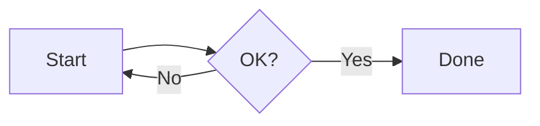

# tscircuit Schematic Test

This file exercises the tscircuit integration. The first render lazy-loads a ~5 MB bundle, so allow a few seconds. Subsequent renders are cached.

## Resistor + capacitor

```tscircuit
export default () => (
  <board width="20mm" height="20mm">
    <resistor name="R1" resistance="1k" schX={-2} />
    <capacitor name="C1" capacitance="1uF" schX={2} />
    <trace from=".R1 .pin2" to=".C1 .pin1" />
  </board>
)
```

## Voltage divider

```tscircuit
export default () => (
  <board width="30mm" height="30mm">
    <resistor name="R1" resistance="10k" schX={0} schY={2} />
    <resistor name="R2" resistance="10k" schX={0} schY={-2} />
    <trace from=".R1 .pin2" to=".R2 .pin1" />
  </board>
)
```

## Mermaid still works alongside tscircuit


